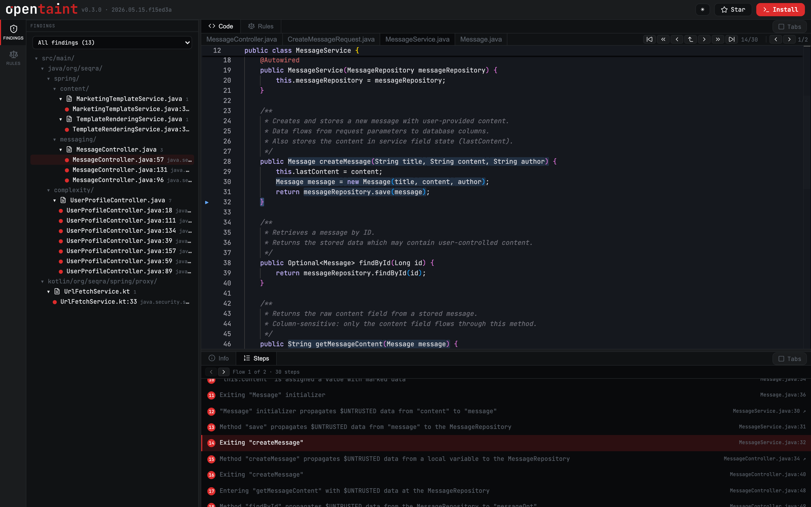

# OpenTaint Viewer

An in-browser, VS Code–style viewer for [OpenTaint](https://opentaint.org/)
taint-analysis results. Point it at any project's SARIF + sources + rules and
get a self-contained, offline HTML report — click through findings, trace each
tainted flow from source to sink, and read the rules that fired, all without a
server.

A bundled demo built from
[`seqra/java-spring-demo`](https://github.com/seqra/java-spring-demo) is committed
so you can [try the viewer instantly](#try-the-bundled-demo).

<picture>
  <source media="(prefers-color-scheme: dark)" srcset="docs/screenshots/viewer-light.png">
  <source media="(prefers-color-scheme: light)" srcset="docs/screenshots/viewer-dark.png">
  
</picture>

## Generate a static HTML report for your project

The viewer is a generic React app that renders one committed `data/content.json`.
To produce a self-contained, offline HTML report for your own project, run three
commands.

### 1. Run OpenTaint to produce a SARIF

**Install the CLI** — it bundles the ruleset alongside the binary at
`<install-prefix>/lib/rules`, so a native install gives you both the engine and
the rules in one step:

```bash
# Linux / macOS
curl -fsSL https://opentaint.org/install.sh | bash

# macOS (Homebrew)
brew install --cask seqra/tap/opentaint

# Windows (PowerShell)
irm https://opentaint.org/install.ps1 | iex
```

**Scan your project** — writes a SARIF report next to it:

```bash
opentaint scan --output results.sarif your-project
```

> **Prefer not to install the CLI?** Run the engine through Docker instead:
>
> ```bash
> docker run --rm \
>   -v "$PWD/your-project:/project" \
>   ghcr.io/seqra/opentaint \
>   opentaint scan --output /project/results.sarif /project
> ```
>
> Docker users also need to extract the ruleset once (the native install
> already includes it):
>
> ```bash
> mkdir -p rules
> docker run --rm --entrypoint sh \
>   -v "$PWD/rules:/out" \
>   ghcr.io/seqra/opentaint \
>   -c 'cp -r /usr/local/lib/opentaint/lib/rules/. /out/'
> ```
>
> Pin the engine by digest (`ghcr.io/seqra/opentaint@sha256:…`) for reproducible
> reports. See the [OpenTaint quick-start](https://github.com/seqra/opentaint#quick-start)
> for the canonical invocation and the digest of the version you intend to use.

### 2. Generate the viewer content

Point `--rules` at the bundled ruleset that came with the install (or at the
`rules/` directory you extracted in the Docker fallback above):

```bash
npm install   # once
npm run gen -- \
  --sarif your-project/results.sarif \
  --src   your-project/src \
  --rules "$(dirname "$(command -v opentaint)")/../lib/rules" \
  --name  your-project
```

That writes `data/content.json`: the findings, the source files they reference
(pruned to only those), the full ruleset, and the analyzer name + version read
from the SARIF (shown in the TopBar, e.g. `v0.3.0 · 2026.05.15.f15ed3a`).

If your SARIF `artifactLocation.uri` values aren't relative to the parent of
`--src` (the common `<root>/src/...` layout), pass `--root <dir>` so collected
file paths match the URIs.

### 3. Build the offline HTML report

```bash
npm run build:single
```

`dist-single/index.html` is a single self-contained file — JS, CSS, fonts, and
Monaco editor all inlined. Open it in a browser or share it as-is; no server,
no network required.

For a hosted (multi-file) build instead, use `npm run build` → `dist/`.

## Use the `opentaint-viewer` CLI

Once installed alongside the engine, point the CLI at a SARIF and either view it
or write a self-contained report. The source root is read from the SARIF's
`%SRCROOT%` (falling back to the report's directory), and the builtin ruleset defaults to
`../lib/rules` next to the CLI — so the common case needs only `--sarif`:

```bash
# Open the report in a browser (localhost)
opentaint-viewer serve  --sarif results.sarif

# Write a self-contained offline HTML report
opentaint-viewer export --sarif results.sarif --out report.html
```

Bring your own rules alongside the builtin set:

```bash
opentaint-viewer serve --sarif results.sarif --rules ./my-rules
```

Override the defaults when needed:

| Option | Default | Meaning |
| --- | --- | --- |
| `--sarif <file>` | — (required) | SARIF report. |
| `--src <dir>` | SARIF `%SRCROOT%`, else the SARIF's directory | Source root. |
| `--builtin-rules <dir>` | `../lib/rules` relative to the CLI | Builtin ruleset directory (the engine's shipped rules). |
| `--rules <dir>` | — (optional) | Your project's custom rules; shown under "Custom" and linked from findings. Custom wins on an id collision with a builtin rule. A rule in neither set still renders, marked "definition not available". |
| `--name <id>` | basename of the source root | Project name in the UI. |
| `--port <n>` (serve) | `5151` | Listen port. |
| `--no-open` (serve) | — | Don't auto-open the browser. |
| `--out <file>` (export) | `opentaint-report.html` | Output HTML path. |

The build-from-scratch path below (`npm run gen` + `npm run build:single`) still
works and is used to regenerate the committed demo.

## Try the bundled demo

The repo commits a `data/content.json` built from `seqra/java-spring-demo`, so
you can see the viewer in action before pointing it at your own project:

```bash
npm install
npm run dev        # start the Vite dev server
```

Then open the URL Vite prints (default http://localhost:5173). The demo covers
**13 findings** — Template Injection, SSRF (Kotlin), and XSS — over the source
files they reference and **47 rules**.

## Features

- **Findings & Rules trees** — a VS Code activity bar switches the left sidebar
  between the findings tree (grouped by directory, with severity dots) and the
  ruleset tree (built-in vs. custom rules).
- **Monaco code editor** with taint-path decorations: the flow is highlighted in
  blue, the sink in red. Jump step-by-step through the path; cross-file hops switch
  the active file automatically.
- **Finding info panel** — rule description (markdown), CWE tags, severity, and the
  ordered list of taint steps (source → propagation → sanitizer → sink).
- **Flexible layout** — toggle the editor and info panel between tabbed and
  side-by-side split views; resizable panels throughout.
- **Light/dark theme** with brand-matched Monaco themes (`ot-light` / `ot-dark`) and
  JetBrains Mono.
- **View persistence** — your selected finding, step, files, and layout are saved to
  `localStorage` and restored on refresh.
- **Offline single-file export** — build a single self-contained `index.html`
  (JS, CSS, fonts, and Monaco all inlined).

## Scripts

| Script | What it does |
| --- | --- |
| `npm run gen` | Generate `data/content.json` from a SARIF + source dir + rules dir. |
| `npm run build:single` | Build a single self-contained offline `index.html` into `dist-single/`. |
| `npm run build` | Type-check (`tsc --noEmit`) and build the hosted site to `dist/`. |
| `npm run cli` | Run the CLI from source via tsx (`npm run cli -- export --sarif …`). |
| `npm run build:dist` | Build the CLI bundle + template into `dist-cli/` (the shippable CLI). |
| `npm run dev` | Vite dev server with HMR. |
| `npm run preview` | Serve the production build locally. |
| `npm test` | Run the unit/component test suite (Vitest) once. |
| `npm run test:watch` | Vitest in watch mode. |
| `npm run coverage` | Vitest with V8 coverage. |
| `npm run e2e` | Playwright end-to-end tests. |

## How it works

The viewer is **fully static** — no backend, no network calls for analysis. It loads
a single bundled content file and renders everything from it:

```
data/content.json   ← committed, pre-analyzed content
        │
        ▼
loadContent()  →  validate (isViewerContent)  →  Zustand store  →  UI
```

The content shape is defined in [`src/types/content.ts`](src/types/content.ts):

- `tool` — the analyzer name and version (semver + build) read from the SARIF.
- `findings` — each with a rule id, vuln class, severity, CWE tags, markdown
  description, primary location, code flows, and ordered `TaintStep`s.
- `files` — the project source files referenced by findings.
- `rules` — the ruleset (`builtin` or `custom`), keyed by their real ruleset-relative
  path so findings can link straight to the rule that defined them.

State lives in a single [Zustand store](src/state/store.ts). The persisted slice (the
*view* — selected finding/step/files and layout, not the bundled content) is written to
`localStorage` under `ot-view` and validated on rehydrate so stale or corrupt storage
can't render an invalid view.

## Project structure

```
src/
  components/   UI: AppShell, TopBar, ActivityBar, trees, EditorArea, InfoPanel, ...
  content/      bundled content + loader/validation
  pipeline/     SARIF → content transform (sarif.ts)
  rules/        rule line/ref helpers
  state/        Zustand store + theme
  taint/        taint-path decorations + step navigation
  types/        content type model + guard
  util/         path, tree, severity, file-tab helpers
scripts/
  gen-content.ts     generates data/content.json from a SARIF + source + rules
e2e/                 Playwright specs
fixtures/            sample SARIF for tests
```

## Testing

- **Unit/component:** [Vitest](https://vitest.dev/) + Testing Library + jsdom
  (`npm test`, coverage via `npm run coverage`). Tests live next to the code they cover.
- **End-to-end:** [Playwright](https://playwright.dev/) (`npm run e2e`). The smoke test
  derives its expectations from the committed content so it survives a `gen` run.

CI (`.github/workflows/ci.yml`) runs the build, coverage, and Playwright suite on every
push to `main` and on pull requests.

## Tech stack

React 18 · TypeScript · Vite · Monaco Editor · Zustand · react-resizable-panels ·
Lucide icons · JetBrains Mono.

## Learn more

- OpenTaint: <https://opentaint.org/>
- Engine & CLI: <https://github.com/seqra/opentaint>
- Demo project analyzed here: <https://github.com/seqra/java-spring-demo>
